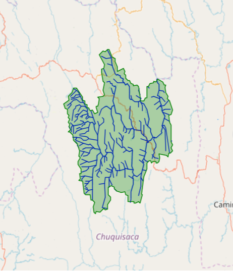
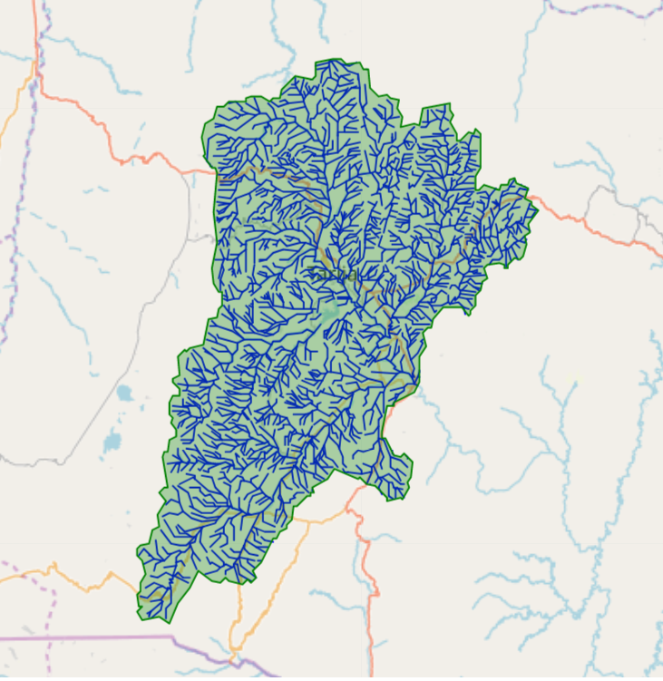
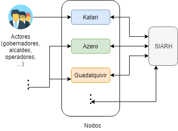
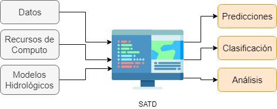
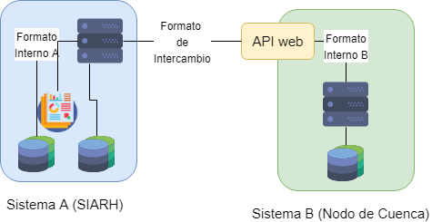

# Análisis de los Sistemas de Información Sectorial para la Gestión Hídrico Ambiental y Propuestas para su Implementación y Operativización en Cuencas Estratégicas

Informe final de la consultoría realizada del 20-12-2018 al 10-12-2019. (Producto 1)

**Autor:** *Sergio Chumacero Figueroa*

## 0. Contenidos

* 1. [Antecedentes](#antecedentes)
* 2. [Objetivos](#objetivos)
* 3. [Metodología](#metodologia)
* 4. [Trabajo Previo](#trabajo_previo)
* 5. [Herramientas de Cuenca: Nodos de Cuenca y SATD](#herramientas)
    * 5.1 [Nodos de Cuenca](#nodos)
    * 5.2 [SATD](#satd)
* 6. [Sistemas de Información del MMAyA: SIARH](#siarh)
* 7. [Propuesta: Base Tecnológica hacia el Desarrollo y Operativización de las Herramientas de Cuenca con respecto los Sistemas de Información existentes](#propuesta)
    * 7.1 [Sistemas de Intercambio Automatizado de Datos](#api)
    * 7.2 [Entornos de Trabajo para Ciencia de Datos](#entornos)

## 1. Antecedentes 

En apoyo al "[Programa Plurianual de gestión integrada de Recursos Hídricos y Manejo Integral de Cuencas 2017-2020](http://www.mmaya.gob.bo/uploads/PNC-Programacio%CC%81nPlurianual2017-2020.pdf)", el "Programa de Gestión Integral con Enfoque de Cuenca" (PROCUENCA) tiene como objetivo general, crear condiciones en cuencas estratégicas para la implementación de planes directores de cuencas para la gestión integrada de recursos hídricos conforme a las directrices del "Plan Nacional de Cuencas".

El programa PROCUENCA se implementa simultáneamiente en dos niveles:

1. A nivel nacional, en apoyo a la construcción de politicas y mecanismos de acción sectorial en torno a la gestión y manejo de cuencas.

2. A nivel de cuencas estratégicas seleccionadas como piloto, tanto para la aplicación y validación de las estrategias e instrumentos sectoriales, como para la generación de nuevas experiencias, aprendizajes y conocimientos que contribuyan al marco estratégico, orientador y operativo del plan nacional de cuencas.

Uno de los objetivos del programa PROCUENCA es el establecimiento de procesos de gestión de información hídrico-ambiental en las dos cuencas que interviene: Las cuencas **Azero** y **Guadalquivir**.

Cuenca Azero (Chuquisaca)

Cuenca Guadalquivir (Tarija)

En el campo de recolección y manejo de datos hídrico-ambientales a nivel nacional, el Ministerio de Medio Ambiente y Agua (**MMAyA**) cuenta con multiples sistemas de información existentes.

Frente a esta situación, el MMAyA a través de su Dirección General de Planificación y Área de Sistemas, está desarrollando el sistema **SIARH** (Sistema de Informacíon Ambiental y de Recursos Hídricos) con el fin de centralizar los distintos sistemas.

Al mismo tiempo, el MMAyA realizó avances en el marco teórico del Sistema de Apoyo a la Toma de Decisiones (**SATD**) como herramienta para la gestión de Planes Directores de Cuencas, que se encuentra en proceso de conceptualización para ser implementado en la cuenca Katari.

En este contexto, se ha identificado la necesidad de contar con un servicio para la
caracterización de los aspectos conceptuales y operativos de los sistemas del MMAyA para la emisión de criterios y recomendaciones que contribuyan a establecer las líneas de apoyo del Programa PROCUNCA al desarrollo y operativización de estos sistemas en las cuencas estratégicas en las que trabaja (Azero y Guadalquivir).

## 2. Objetivos 

Con el fin de aclarar el panorama actual en el campo de manejo de datos del sector y proponer herramientas de apoyo a los objetivos del PROCUENCA relacionados a la gestión de información, se establecieron los siguientes objetivos:

* Descripción y análisis del sistema de información del MMAyA en relación al SATD y Nodos de Cuenca con miras a su implementación y operativización en las cuencas Azero y Guadalquivir.
* Recomendaciones, apreciaciones, análisis y propuestas con respecto a los siguientes temas:
    * Integración de sistemas del MMAyA relacionados a cuencas y recursos hídricos a nivel de manejo y gestión de datos.
    * Desarrollo de los sistemas de información a nivel de cuencas estratégicas en relación al SATD y su integración con el sistema de información del MMAyA.
    * Tecnologías relacionadas a los temas previos:
        * Sistemas de intercambio automatizado de datos.
        * Entornos de computo Cloud.
* Elaboración de una base de datos para las cuencas Azero y Guadalquivir, con información disponible y relevante para la gestión hídrico-ambiental.

## 3. Metodología 

Para la elaboración de esta consultoría se partió de una serie de reuniones con personal de la Dirección General de Planificación y el Área de Sistemas del MMAyA, así como con personal de PROCUENCA para establecer la situación general de los sistemas de información actuales relacionados a la gestión hídrico-ambiental en cuencas estratégicas y obtener acceso a los sistemas y datos disponibles.

Específicamente, conté con acceso a:
* Los sistemas de acceso público del MMAyA.
* La versión en desarrollo del Sistema de Información Ambiental y de Recursos Hídricos (SIARH).
* Datos de oferta Hídrica Superficial proporcionados de manera directa.
* Datos de la cuenca Guadalquivir proporcionados de manera directa.

Junto con la información derivada de estas reuniones, hice uso también del trabajo previo realizado en dos consultorías previas:

* [1]  Análisis del Estado del Software y Hardware de Sistemas de Información del Sector de Medio Ambiente y Agua, para la Consolidación de un Sistema Integrado de Información. (21.09.2017 - BISIT S.R.L.)
* [2]  Implementación de la Página Web y Análisis e Ingeniería a Diseño Final del Sistema de Información Geográfico SISGE-KATARI de la Cuenca Katari y Lago Menor del Titicaca. (Southern STH S.R.L)
    * Producto Final - Diseño del Sistema SIG Web y especificaciones Técnicas
    
Con respecto al objetivo 2, en base al trabajo previo, los datos recopilados y la información derivada de las reuniones, elaboré las propuestas de tecnologías específicas detalladas en este documento que considero de gran relevancia como base para la implementación del SATD y Nodos de Cuenca en las cuencas Azero y Guadalquivir.

Finalmente, implementé de manera piloto un entorno de trabajo que almacena la información recopilada de las cuencas estratégicas, ofrece una aplicación interactiva de exploración de los datos geo-referenciados y es capaz de responder a las necesidades tecnológicas básicas del SATD.

## 4. Trabajo Previo 

En el campo de recolección y manejo de datos hídrico-ambientales a nivel nacional, el MMAyA cuenta con multiples sistemas de información existentes.

Un relevamiento exhaustivo de estos sistemas fue realizado en [[1]](#bisit). Como producto de esta consultoría se presentó también un análisis comparativo respecto a un sistema ideal para el MMAyA (definido en la misma consultoría), producto del cual los consultores derivan las siguientes recomendaciones:
* La aplicación de **ciencia de datos** como paradigma para la recopilacion y procesamiento de la información.
* La constitución del "Centro de Gestión del Conocimiento en Agua Saneamiento y Medio Ambiente", que se basa en la centralización de la infraestructura tecnológica del MMAyA.

Actualmente el MMAyA a través de su Dirección General de Planificación y Área de Sistemas, está desarrollando el sistema **SIARH** (Sistema de Informacíon Ambiental y de Recursos Hídricos). El SIARH tiene como objetivo la centralización de los distintos sistemas existentes del MMAyA bajo una sola plataforma de desarrollo alimentado por un sistema central de base de datos que opere en un servidor físico en sus instalaciones de obrajes. 

En avance hacia la implementación de herramientas de apoyo a la gestión de recursos hídricos a nivel de plan director de cuenca, el MMAyA realizó una consultoría ([[2]](#southern)) que sirve de conceptualización de una herramienta de gestión de datos para la cuenca Katari, el SISGE-KATARI.

Entre las funciones del SISGE-KATARI destacan sus herramientas de visualización y permitiría la captura de datos desde dispositivos móviles y sensores remotos.

## 5. Herramientas de Cuenca: Nodos de Cuenca y SATD 

Trabajando el programa PROCUENCA tanto a nivel nacional como directamente con las cuencas intervenidas de Azero y Guadalquivir, este se encuentra en la posición ideal para apoyar al MMAyA en la implementación y operativización de herramientas que hagan uso de los datos específicos de cuenca del sistema de información del MMAyA, tanto de ingreso como de salida. 

Dos de estas herramientas son los "Nodos de Cuenca" y el "SATD" (Sistema de Apoyo a la Toma de Decisiones). La primera actua como interfaz entre los distintos actores de cuenca y el sistema de información del MMAyA. La segunda herramienta hace uso de los datos de cuenca y ofrece herramientas automatizadas a los responsables de gestión de cuenca para la toma de decisiones.   

A continuación definimos estos términos, los ponemos en contexto con respecto al sistema de información del MMAyA y caracterizamos algunas de sus funciones.

### 5.1 Nodos de Cuenca 

**Definición:** El Nodo de una cuenca es el punto de Acceso de los distintos actores de la cuenca al sistema de información del MMAyA e incluye el subconjunto de datos del sistema concernientes a las funciones de estos actores.

En relación al sistema de información del MMAyA, un nodo de cuenca debe contar con acceso a los datos reportados por otras vías. Algunos de los subsistemas que gestionan los datos relacionados con los nodos de cuenca son el SISMO (Sistema de Planificación, Seguimiento y Monitoreo), que maneja matrices de indicadores y POAs y el SISPM (Sistema de Priorización de Microcuencas) que maneja datos de PDMs, POAs y estudios de investigación a nivel de microcuencas.

Los distintos actores de cuenca harían uso del nodo de cuenca a través de una aplicación web que les permita monitorear la información concerniente a sus funciones con herramientas de visualización, filtrado, importación y exportación de datos. Por medio de esta aplicación, los actores serían capaces de reportar información a los distintos subsistemas que requieran de estos datos.

### 5.2 SATD 

**Definición:** El SATD (Sistema de Apoyo a la Toma de Decisiones) es un sistema capaz de hacer uso de los datos de cuenca y ofrecer herramientas automatizadas de análisis y predicción que sirvan de apoyo en tareas de gestión de cuenca.

En relación al sistema de información del MMAyA, una implementación del SATD  debe contar con acceso a datos georeferenciados relacionados al balance hídrico de la cuenca, tanto superficial como subterránea, información detallada de proyectos e información meteorológica, como mínimo.

Los subsistemas del MMAyA que gestionan esta información son el GEOSIRH (Sistema de Información de Recursos Hídricos Geográficos), el VIBH (GeoVisor de Manejo de Información de Balances Hídricos) y el SIASBO (sistema de Información de Agua Subterránea en Bolivia). El sistema que gestiona los datos meteorológicos a nivel nacional es el SISMET (Sistema Meteorológico) operado por el SENAMHI (Servicio Nacional de Meteorología e Hidrología).

Por medio de un entorno de trabajo implementando el SATD, se ofrecerían herramientas y aplicaciones a los actores de cuenca encargados de funciones de gestión. Estas herramientas permitirían, por ejemplo, modelar y predecir el impacto de proyectos en el balance hídrico de la cuenca.

## 6. Sistemas de Información del MMAyA: SIARH 

A continuación enlistamos los sistemas de información del MMAyA, su estado actual, su función principal, el tipo de datos que manejan y la relevancia de estos datos con respecto al SATD y Nodos de Cuenca. Para mayor información técnica y de infraestructura de estos sistemas, referirse a [[1]](#bisit). 

Cabe remarcar que encima de la base de datos de estos subsistemas, usualmente se encuentra en producción un sistema de gestión de estos datos haciendo uso de aplicaciones web.

**Sistemas altamente relevantes para el SATD**

Los siguientes sistemas contienen información altamente relevante para la implementación del SATD. La relevancia de los datos con respecto al SATD fue acordada de manera conjunta con técnicos del MMAyA.

* **[GEOSIRH](http://geo.sirh.gob.bo)**  (Sistema de Información de Recursos Hídricos Geográficos) - Gestión de información georeferenciada de recursos hídricos a nivel nacional. Datos: Áreas de planes directores de cuencas, Áreas de cuencas transfronterizas, datos de unidades de cuenca, datos de unidades de calidad de agua, datos de unidades de riesgos hidrológicos, proyectos de riego. 

* **[VIBH](http://vibh.mmaya.gob.bo)** (GeoVisor de Manejo de Información de Balances Hídricos) - Aplicación web con el fin de gestionar la información de balance hídrico a nivel nacional. Datos georeferenciados: Matrices de escurrimiento, evapotranspiración, flujo base, precipitación, streamflow.

* **[SIASBO](http://http://dev.sirh.gob.bo/index.php?module=siasbo&smodule=geovisor)** (Sistema de Información de Agua Subterránea en Bolivia) - Datos georeferenciados de pozos y manantiales.

Adicionalmente, los datos meteorlógicos gestionados por el SENAMHI desde el sistema SISMET (Sistema Meteorológico) entran dentro de la demanda de datos del SATD.

**Sistemas eventualmente relevantes para el SATD**

* **[SIAB](https://siab.sirh.gob.bo/)** (Sistema de Información de Agua Potable y Saneaminento en Bolivia) - Aplicación web con el fin de gestionar información de agua potable y saneamiento en áreas rurales. Datos: Reportes de proyectos.
* **[SNIA](http://snia.mmaya.gob.bo)** (Sistema Nacional de Información Ambiental) - Aplicación web con el fin de administrar los procesos de prevención y control de la calidad ambiental. Datos: Inspecciones UGA y UFCA, datos de educación ambiental, datos de toneladas de exportación para disposición final, datos de SAO importado vs. cupo anual, registro de archivos vinculados a documentos ambientales.

**Sistemas relevantes para Nodos de Cuenca** 

* **[SISMO](http://sismo.cuencasbolivia.org)** (Sistema de Planificación, Seguimiento y Monitoreo) - Aplicación web con el fin de realizar seguimiento y monitoreo a los planes directores de cuenca. Datos: Matrices de Indicadores y POA.
* **[SISPM](http://priorizacion.cuencasbolivia.org)** (Sistema de Priorización de Microcuencas) - Aplicación web con el fin de realizar la priorización de microcencas en el marco de planes directores de cuencas. Datos: PDMs, POAs y estudios de investigación.

**Sistemas activos pero no-relevantes**

Los siguientes sistemas se encuentran actualmente activos, pero no manejan datos relevantes al SATD o Nodos de Cuenca.

* **[CODICE](http://codice.mmaya.gob.bo)** - Manejo de correspondencia.
* **[SIAL](http://sial.mmaya.gob.bo)** (Sistema de Almacenes) - Gestión de ítems dentro de almacenes.
* **Contabilidad Visual** - Aplicación de escritorio con el fin de gestionar la información contable de acuerdo a parámetros del POA.
* **[Sistema de RRHH](http://personal.mmaya.gob.bo)** (Sistema de Recursos Humanos) - Aplicación web con el fin de gestionar los recursos humanos del MMAyA.

**Sistemas inactivos**

Los siguientes subsistemas se encuentran actualmente inactivos, lo que significa que sus funciones fueron transferidas a otro sistema, que todavía se encuentra en desarrollo o que sus funciones ya no son utilizadas.

* **[SIAM](http://siam.mmaya.gob.bo)** (Sistema de Información de Agua y Medio Ambiente) - Sistema general de información subsectorial. Maneja matrices de proyectos, ejecución presupuestaria, inicio y entrega de obras.
* **[SIG-SNIA](http://http://190.129.84.22/sig_snia/)** (Geovisor del sistema SNIA)
* **[SISGP](http://sisgp.mmaya.gob.bo)** (Sistema de Información de Gestión de Proyectos en Pre-Inversión)
* **ContaPOA** (Sistema de Monitoreo de Ejecución Presupuestaria y POA) - Aplicación de escritorio con el fin de gestionar la información contable de acuerdo a parámetros del POA.
* **SPYS** (Sistema de Programación y Seguimiento) - Aplicación de escritorio con el fin de gestionar la información contable de la oficina central del MMAyA.

## 7. Propuesta: Base Tecnológica hacia el Desarrollo y Operativización de las Herramientas de Cuenca con respecto los Sistemas de Información existentes 

En este capítulo introducimos conceptos y tecnologías en las áreas de desarrollo de software, desarrollo web, manejo de datos y computo cloud, que consideramos buenas practicas en general y las aterrizamos a las necesidades específicas para la implementación de las herramientas de cuenca en el contexto actual de sistemas del MMAyA.

El motivo por el cual añadimos la descripción de estos conceptos y tecnologías al trabajo es porque sentimos que la falta de consideración de estos aspectos puede resultar perjudicial en la fase de implementación de las herramientas de cuenca, en especial porque se pudo identificar la falta de aplicación de estos conceptos en mayor o menor medida dentro del desarrollo actual de los sistemas del sector.

**Desarrollo Ágil**
    
El desarrollo de sistemas y herramientas de software (sean estas desktop o web) es un proceso iterativo. Es decir, partiendo de un producto base mínimo, la experiencia de uso y actualizaciones en el campo dan lugar a mejoras y correciones que deriven en un producto estable superior. 

Es por este motivo que antes de partir de la presunción de conocer todos los detalles de un producto de antemano, es preferible tener una primera versión implementada lo antes posible, sobre la cual uno pueda trabajar en mejoras y extensiones de manera iterativa.

Para permitir este tipo de desarrollo, es necesario contar con un entorno de desarrollo dinámico, fácil acceso a los datos requeridos y eliminar dependencias dentro de lo posible con otros equipos y sistemas.

*Nota: En el desarrollo de proyectos, aplicaciones y sistemas sectoriales, es común contar con una fase de conceptualización, en la cual se especifican los detalles del proyecto o aplicación con el fin de avanzar de mejor manera llegada la fase de implementación. Por ejemplo, [[2]](#southern) es un trabajo que entra dentro de la fase de conceptualización de la aplicación SISGE-KATARI. El problema con esta metodología de trabajo en el campo de desarrollo de software, es que se corre el riesgo de limitar las opciones de implementación al punto de resultar contraproducente.*

**Libertad de Herramientas de Desarrollo**

Otro aspecto determinante en el éxito de desarrollo es el uso de las herramientas de software apropiadas para la tarea. En general, en el campo de desarrollo de software, no existe una herramienta que sobresalga en todo tipo de aplicaciones. Lo que se tiene es comunidades especializadas para cada tipo de aplicación y son estas comunidades las que desarrollan las mejores herramientas de software para sus aplicaciones. 

Si limitamos el uso de herramientas y lenguajes de programación, posiblemente estamos cerrando la posibilidad de uso de buenas herramientas para la tarea en mano.

La limitación del uso de tecnologías de código abierto, de acuerdo al decreto supremo 1793, no es una limitación fundamental, ya que la mayoría de herramientas estándar a nivel mundial estan basadas en software libre.

El verdadero problema viene cuando se especifica de manera directa las herramientas de software que deben ser usadas a nivel institucional o de acuerdo a lineamientos del proyecto.

**Centralización de Infraestructura vs. Centralización de Sistemas en General**

Una de las recomendaciones en [[2]](#bisit) es avanzar en el proceso de centralización de infraestructura de los diferentes sistemas del MMAyA. Este proceso es beneficioso porque optimiza costos de mantenimiento y servicios. 

Sin embargo, el hecho de que el concepto de  centralización sea beneficioso a nivel de infraestructura, no significa que sea beneficioso a nivel de software, donde los problemas de dependencias y compatibilidad son de gran relevancia. 

Actualmente en el desarrollo del SIARH se apunta a que el desarrollo de sus módulos sean abarcados dentro de la misma plataforma de desarrollo, es decir que utilizen las mismas herramientas de software. 

Una ventaja de esta estratégia es la simplificación de los procesos de desarrollo y mantenimiento para el equipo de desarrollo del SIARH de los subsistemas que hayan sido portados a esta plataforma de desarrollo.

Las desventajas de esta estratégia son la limitación del uso de herramientas de software y la creción de dependencias entre equpios de desarrollo, en especial para la creación de aplicaciones y sistemas futuros.

Una solución a estas desventajas que mantiene la ventaja de fácil acceso y uso de datos y servicios entre sistemas es la implementación de protocolos de comunicación entre sistemas.

**Recomendaciones Para Herramientas de Cuenca** 

Las recomendaciones propuestas a continuación apuntan al uso de tecnologías que fomentan un estilo de desarrollo ágil para aplicaciones que hagan uso de los datos de cuenca, como los nodos de cuenca y el SATD.

Específicamente:
* Los sistemas de intercambio automatizado de datos hacen frente a la necesidad (tanto de ingreso como de salida) de datos de las aplicaciones, sin crear dependencias de las tecnologías específicas de los sistemas que gestionan esta información.

* Los servicios Cloud, como alternativa de infraestructura, reducen significativamente las actividades relacionadas con la puesta en producción, mantenimiento, monitoreo, extensión/reducción de servicio, seguridad y manejo de servicios básicos (internet, electricidad), entre otras actividades. Como resultado, más recursos pueden ser asignados al desarrollo de aplicaciones y la calidad de las mismas.

* La creación de entornos de trabajo propuesta fomenta el desarrollo dinámico ofreciendo a los usuarios herramientas de trabajo avanzado, colaboración y publicación. Desde estos entornos, el usuario tiene acceso a los datos actualizados necesarios para el trabajo.

A continuación, describimos de manera conceptual los conceptos básicos de las herramientas propuestas y proponemos su uso para la implementación de las herramientas de cuenca, en relación a los sistemas existentes del MMAyA.
   

### 7.1 Sistemas de Intercambio Automatizado de Datos 

**Definiciones y Conceptos Generales**

Un concepto básico en el desarrollo de software es el de una **API** (Application Programming Interface o en español "Interfaz Programática de Aplicación"). En su aspecto más general, una API es un protocolo de comunicación con un componente de código, sistema o aplicación.

En general las APIs son ubicuas en el desarrollo de sistemas, tenemos APIs que facilitan el uso de librerias de código, APIs que traducen librerias entre lenguajes, APIs que nos permiten comunicar nuestro código con aplicaciones web, entre otros usos. 

Una **API web** es una API cuya comunicación es realizada a través de un protocolo web, por ejemplo HTTP(s). El intercambio de información por medio de un servicio API web es realizado en un formato de intercambio (comunmente JSON o XML).

En el contexto de manejo de datos, podemos implementar APIs web que nos permitan comunicar nuestros datos entre sistemas, ofreciendo **puntos de acceso** a subconjuntos de datos específicos.

Los puntos de acceso implementados por un servicio API y el tipo de datos que ofrecen pueden ser descritos de manera previa haciendo uso de **protocolos API**. Estos son útiles ya que ayudan a los usuarios del servicio a interactuar con el sistema, es decir sirven de documentación. Nos podemos imáginar a un protocolo API como un contrato de servicio, especificando el modo de uso del servicio y las garantías que este ofrece.

El servicio API es considerado **interno** si esta implementado con el fin de servir sólamente sistemas de la misma institución. El acceso a un subconjunto de datos en este caso es controlado por un protocolo de seguridad y otorga llaves de acceso o "tokens" a los sistemas autorizados. De esta manera podemos garantizar que la API no esta sirviendo datos a sistemas no-autorizados.

*Nota: Si bien utilizamos APIs web como ejemplo, bien podriamos utilizar otro medio de comunicación. Por ejemplo, si los sistemas que queremos utilizar se encuentran dentro del mismo servidor (como es el caso del SIARH) podríamos utilizar otros métodos de comunicación (como ZeroMQ).*  

**Ejemplo Básico de Uso**

Para ilustrar el uso de un API web de manera directa, usaremos un ejemplo.
Para este ejemplo partimos de un sistema, aplicación o entorno de trabajo (Sistema A) que requiere acceder a un subconjunto específico de datos almacenado en otro sistema (Sistema B) que ofrece un servicio de datos via web API. 

Para aterrizar todavía más el concepto, podemos imaginar que Sistema A corresponde al SIARH y que Sistema B corresponde a una implementación de un Nodo de Cuenca en el cual tenemos almacenada información de proyectos ingresada por alguna gobernación.

0. (Sistema A solicita una llave de acceso al sistema B a través de un protocolo de seguridad estándar.\)
1. Sistema A realiza un pedido HTTP(s) en un formato de intercambio a un punto de acceso específico portando su llave de acceso.
2. Sistema B verifica la legalidad de la llave de acceso.
3. Sistema B traduce el pedido a un formato interno de su sistema.\
4. Sistema B accede a su base de datos y recupera la información solicitada. (Todavía en un formato interno.)
5. Sistema B traduce el pedido al formato de intercambio acordado entre sistemas.
6. Sistema B manda su respuesta a Sistema A (via HTTP(s)) adjuntando los datos solicitados.
7. Sistema A recibe su respuesta y traduce el contenido a un formato interno, listo para su consumo (o almacenamiento).

*Notas:*

*De manera interna, tanto Sistema A como Sistema B pueden almacenar sus datos de la manera que vean más conveniente, utilizar los modelos de datos que les sean más útiles a sus aplicaciones y hacer uso de las tecnologías y lenguajes con los que sus desarrolladores se sientan más cómodos. Es decir, el uso de un formato de intercambio para la comunicación y los procesos de traducción permiten aislar el funcionamiento interno de los sistemas, eliminando así problemas de dependencia.*

**Propuesta de Implementación para Nodos de Cuenca**

**Propuesta** 

Implementar un sistema de manejo de bases de datos a nivel de plan director de cuenca que ofrezca un servicio API web interno desde el cual el sistema de información del MMAyA pueda solicitar la información alimentada por los distintos actores de cuenca y empujar información relevante para los distintos actores.

**Especificaciones**

Para los distintos actores de cuenca se crean aplicaciones web desde las cuales ellos pueden cargar datos a través de una interfaz gráfica. 
Estos datos son transferidos al sistema haciendo uso de puntos de acceso del servicio API.

Dependiendo de las necesidades de monitoreo y uso de datos de los actores de cuenca, se crean también aplicaciones web que consuman datos por medio del servicio API y proporcionen herramientas de visualización, filtrado y procesamiento de datos.

Las aplicaciones web pueden ser servidas desde el mismo servidor que implemente el servicio API. Alternativamente, estas aplicaciones puedes ser servidas desde el servidor del SIARH.

Cada cuenca utiliza un modelo de datos distinto, esto refleja las variaciones en disponibilidad de datos de cada plan director de cuenca. 

Si bien los modelos de datos pueden variar, las herramientas de software utilizadas por distintas cuencas pueden ser las mismas.

Los puntos de acceso que implementa el sistema API son especificados por un protocolo API elaborado por el área de sistemas del MMAyA, asegurando así la consistencia de uso por parte del área de sistemas del MMAyA.

Cada cuenca puede escoger las herramientas de software utilizadas para implementar el protocolo API especificado por el MMAyA para esa cuenca. Esto es posible gracias a la naturaleza "agnóstica" con respecto al lenguaje de programación de los protocolos API.

Debido a la naturaleza impredecible del consumo de datos, los recursos computacionales proporcionados a cada nodo deben preferentemente aumentar y reducir de manera dinámica. Debido a esto y la necesidad de consistencia de servicio es recomendable hacer uso de servicios cloud como alternativa de infraestructura.

**Propuesta de Implementación para SATD**

**Propuesta**

Extendiendo el sistema API usado para implementar los Nodos de Cuenca descritos previamente, el SATD es implementado como un entorno de trabajo Cloud optimizado para ciencia de datos desde el cual podemos solicitar datos al servicio API, hacer uso de modelos hidrológicos y herramientas previamente elaboradas y hacer uso de estos insumos por medio de recursos computacionales asignados al entorno.

**Especificaciones**

Al servicio API de nodos se le añaden puntos de entrada para datos de subsistemas relacionados al SATD. Estos datos son provistos de manera periodica (mensual, anual) desde el sistema central de información del MMAyA para que sean servidos a los entornos de trabajo.

Los entornos de trabajo cuentan con los lenguajes de programación y paquetes requeridos por los técnicos encargados de elaborar herramientas, modelos y hacer uso de los datos de cuenca.

### 7.3 Entornos de Trabajo para Ciencia de Datos

Un sistema de información adecuado abre la posibilidad del uso de tecnologías más avanzadas en el sector de estadística y ciencia de datos. En los últimos años, estas tecnologías han demostrado ser de gran importancia, permitiendo la creación de aplicaciones prácticas más avanzadas como predicciones, reconocimiento de patrones, asociaciones, clasificación, etc.

En vez de desarrollar una aplicación específica para el trabajo con un conjunto específico de datos, es común en el campo de ciencia de datos, contar con un entorno completo de trabajo capaz de generar modelos, herramientas y visualizaciones de manera dinámica. 

Este tipo de entornos de trabajo permiten correr código e interactuar con los datos y objetos de programación de manera interactiva, permitiendo así un ritmo de trabajo acelerado.

Con los avances en el campo de desarrollo web, hoy en día es posible contar con entornos de trabajo con los cuales interactuamos a través del navegador y ofrecen herramientas de colaboración, visualización, computo, entre otras.

Este tipo de entornos de trabajo son extensibles, permitiendonos crear componentes y herramientas a medida de las necesidades cambiantes y emergentes del MMAyA.

Combinando estos avances con tecnología Cloud, tenemos como resultado un entorno de trabajo completo al cual accedemos desde el navegador y cuyo código corre en servidores externos de gran capacidad.

**Aplicacines Web vs. Entornos de Trabajo basados en Tecnologías Web (o Cloud)**

Dentro de la arquitectura web "cliente-servidor" sobre la cual se construye el internet al que estamos acostumbrados, como desarrolladores podemos correr código en dos ambientes distintos: El servidor y el navegador. Esto crea la diferenciación entre el desarrollo "back-end" y "front-end" respectivamente. 

El servidor nos ofrece un ambiente computacional completo (herramientas) y una grán cantidad de recursos computacionales (memoria, CPU). Mientras que el servidor por todas sus limitaciónes de recursos y de herramientas, nos ofrece una interfaz para el usuario estándarizada (una herramienta que corre en un servidor puede ser accesible desde todo tipo de dispositivos: Computadoras Desktop, Laptops, teléfonos, tablets, televisores, etc...) Estos dos ambientes se comunican a través de protocolos de transferencia y sistemas de comunicación automatizada (APIs).

Una aplicación web convencional recupera el código del servidor y accede a recursos proveídos por el servidor para alimentar la aplicación desde el navegador. 

La ventaja de las aplicaciones web convencionales, es que debido a su ligereza, pueden ser servidas a una gran cantidad de usuarios con un uso de recursos computacionales modesto.

Con el avance en tecnologías front-end, back-end, API e infraestructura (en su mayoría Cloud), los recursos ofrecidos por los servidores a las aplicaciones web se ha extendido 

Dentro del sector, el uso de aplicaciones web en el ámbito de manejo de datos es adecuado para:
* El ingreso y descarga de datos.
* Visualización y monitoreo.
* Publicación.

Dentro del sector, el uso de entornos de trabajo basados en tecnologías web en el ámbito de manejo de datos es adecuado para:
* El ingreso y descarga de datos.
* Visualización y monitoreo
* Procesamiento de datos:
    * Limpieza de datos
    * Análisis de datos
    * Generación de reportes
    * Aprendizaje Automatizao
    * Generación de Modelos (Aprendizaje Automatizado)
* Desarrollo de herramientas de visualización y monitoréo. 

**Prueba de Uso: Entorno de Trabajo [mmayalab.ml](mmayalab.ml)**

Entendiendo la novedad de este estilo de herrramientas, creí necesario poner a prueba sus capacidades y limitaciones. 

Este servicio está activo bajo el dominio "mmayalab.ml" y está implementado en un servidor del proveedor Cloud de Google (Google Cloud Platform). Esta herramienta también puede ser puesta en producción en servidores en premisa (servidores físicos), asumiendo que estos proporcionen los requerimientos mínimos de funcionamiento.

Las tecnologías utilizadas para la creación de este servicio (Jupyter & Kubernetes) fueron publicadas bajo licencias del tipo "open source" (BSD & Apache respectivamente), por lo que se adecuan a los planes nacionales de desarrollo tecnológico para instituciones públicas.

Los recursos de computo del sistema fueron calculados para proveer hasta 5 usuarios con un entorno de computo de alta capacidad. Y haciendo uso de tecnologías de orquestración de contenedores (Kubernetes) es posible extender el servicio de manera dinámica a una capacidad indefinida de usuarios (por ejemplo, el proyecto [binder](https://mybinder.org) llega a orquestrar decenas de miles de usuarios simultáneos en este tipo de entornos de trabajo).  

Dentro del sistema pusimos los datos geo-referenciados recopilados relacionados al SATD y creamos una aplicación interactiva que permite seleccionar capas y explorar sus datos por medio de diagramas interactivos.
